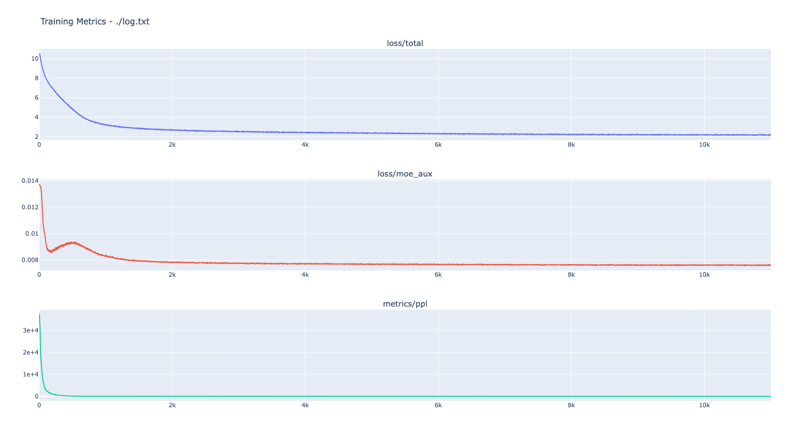
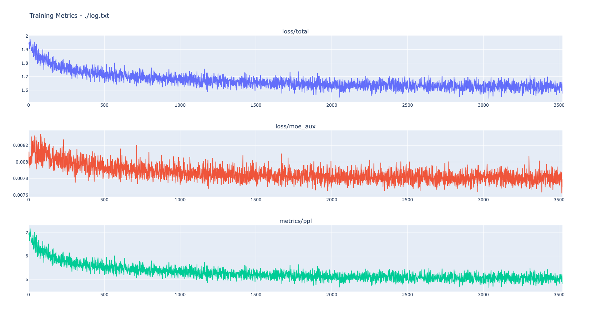
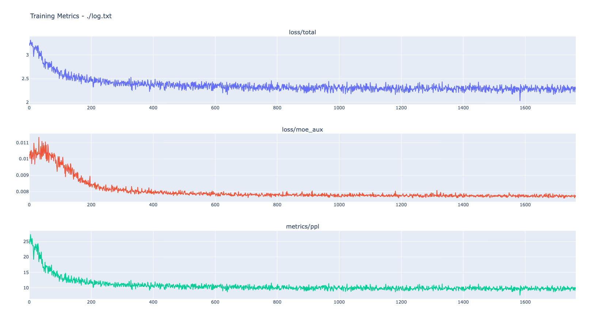
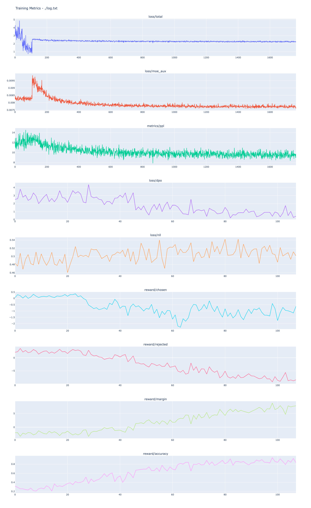
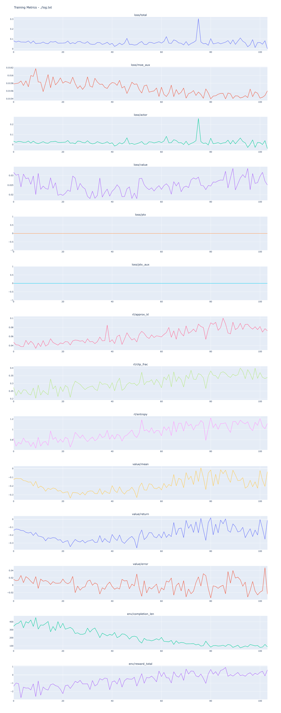

<div align="center">
    
</div>

<div align="center"><b>从零构建大模型：从预训练到RLHF的完整实践</b></div> <br />

<div align="center">


[](https://github.com/qibin0506/Cortex/stargazers)
[](LICENSE)
[](https://github.com/qibin0506/Cortex/commits/master)
[](https://github.com/qibin0506/Cortex/pulls)
</div>

## 📖 项目简介

**Cortex** 是一个致力于让个人开发者也能承担训练成本的 LLM 项目。本项目实现了从零开始构建大模型的全过程，代码完全开源且解耦。

### 🌟 Cortex 3.1 核心特性

*   **国产芯片适配**：首次在国产芯片（MLU370 × 4 ）完成全流程训练。
*   **极致轻量 MoE 架构**：面回归混合专家（MoE）设计，模型总参数量仅 0.1B，推理激活参数低至 ~67M，实现极低算力设备上的超高推理吞吐。
*   **LLM as Judge 驱动的 PPO 训练**：在强化学习阶段，引入大语言模型作为裁判（LLM as Judge）提供反馈信号，显著提升对齐训练的质量与效率。
*   **前沿架构特性扩展**：新增对 Attention Residuals（注意力残差）机制的支持。为了保持灵活性该功能默认关闭，开发者只需在 utils.py 中修改 ENABLE_ATTN_RES 即可轻松解锁探索。
*   **思考控制**：支持思考控制，通过添加`/think`和`/no think`标签选择开启/关闭思考模式。
*   **全链路训练代码 100% 开源**：开放全生命周期训练流，涵盖：Pretrain（预训练）、Midtrain（上文适应）、SFT（指令微调）、DPO（偏好优化） 以及 PPO（强化学习）。
*   **高度解耦**：
    *   🤖 模型定义：[qibin0506/llm_model](https://github.com/qibin0506/llm_model)
    *   ⚙️ 训练框架：[qibin0506/llm_trainer](https://github.com/qibin0506/llm_trainer)


## 📰 更新日志
<details open> 
<summary> <b>2026.5.16</b> </summary>
    
*   Cortex 3.1 MoE模型发布：支持通过添加`/think`和`/no think`标签控制是否开启思考。

</details>


## 🚀 快速开始

### ☁️ 在线体验

访问 ModelScope 创空间直接体验模型效果：

[👉 点击前往 ModelScope Studio](https://www.modelscope.cn/studios/qibin0506/Cortex)

### 💻 本地部署

1.  **环境准备**：确保 Python >= 3.10。
2.  **获取代码**：

    ```
    git clone https://github.com/qibin0506/Cortex.git
    cd Cortex

    ```
3.  **安装依赖**：

    ```
    pip3 install -r requirements.txt

    ```
4.  **启动服务**：

    ```
    python3 app.py

    ```

    *首次运行将自动下载模型文件，启动后访问 <http://0.0.0.0:8080/> 即可体验。*

## ⚙️ 训练流程详解

### 阶段性训练指南

训练过程分为四个主要阶段，请按顺序执行。

| **阶段**           | **脚本**                           | **上下文** | **目标与说明**   |
|:-----------------|:---------------------------------| :------ | :---------- |
| **I. Pretrain**  | `train_pretrain.py`              | 512     | **基础知识学习**。 |
| **II. Midtrain** | `train_midtrain.py`              | 2048    | **长文本适应**。  |
| **III. SFT**     | `train_sft.py`                   | 2048    | **对话能力赋予**。 |
| **IV. DPO/PPO**  | `train_dpo.py` /  `train_ppo.py` | 2048    | **人类偏好对齐**。 |

#### 🔧 通用操作：监控与 Checkpoint 转换

*   **监控**：日志位于 `./log` 目录。

    *   查看指标：`vis_log ./log/log.txt`
    *   查看学习率：`vis_lr ./log/lr.txt`
*   **Checkpoint 转换**：每个阶段结束后，DeepSpeed 的 Checkpoint 需要转换为标准 bin 文件以便下一阶段加载。

***

#### 📌 阶段一：Pretrain (预训练)

```
# 1. 开始训练
smart_train train_pretrain.py

# 2. 转换权重 (训练完成后执行)
cd ./ckpt_dir
python3 zero_to_fp32.py ./ ../
cd ..
mv pytorch_model.bin last_checkpoint.bin

# 3. 清理
rm -rf ./ckpt_dir ./log

```

> 📊 **Pretrain 指标预览**
>
> 

#### 📌 阶段二：Midtrain (长文适应)

```
# 1. 开始训练 (自动加载 last_checkpoint.bin)
smart_train train_midtrain.py

# 2. 转换权重
cd ./ckpt_dir
python3 zero_to_fp32.py ./ ../
cd ..
mv pytorch_model.bin last_checkpoint.bin

# 3. 清理
rm -rf ./ckpt_dir ./log

```

> 📊 **Midtrain 指标预览**
>
> 

#### 📌 阶段三：SFT (监督微调)

```
# 1. 开始训练
smart_train train_sft.py

# 2. 转换权重并归档
cd ./ckpt_dir
python3 zero_to_fp32.py ./ ../
cd ..
mv pytorch_model.bin last_checkpoint.bin
cp last_checkpoint.bin sft.bin

# 3. 清理
rm -rf ./ckpt_dir ./log

```

> 📊 **SFT 指标预览**
>
> 

#### 📌 阶段四（可选1）：DPO

```
# 1. 开始训练
smart_train train_ppo.py

# 2. 转换权重
cd ./ckpt_dir
python3 zero_to_fp32.py ./ ../
cd ..
mv pytorch_model.bin dpo.bin

# 3. 清理
rm -rf ./ckpt_dir ./log

```

> 📊 **DPO 指标预览**
>
> 

#### 📌 阶段四（可选2）：PPO (强化学习)

1. 本阶段包含 Policy Model 和 Value Model 的联合训练。
2. 本次训练采用LLM as Judge作为奖励模型，可以通过设置`JUDGE_API_KEY`（必选）、`JUDGE_BASE_URL`（可选，默认为siliconflow.cn）、`JUDGE_MODEL`（可选，默认为DeepSeek-V3.2）选择适合自己的LLM作为奖励模型。
注意：如果`JUDGE_BASE_URL`、`JUDGE_MODEL`选择默认，`JUDGE_API_KEY`需要去siliconflow申请，具体方式请参考官网。

```
# 1. 开始训练
smart_train train_ppo.py

# 2. 转换权重
cd ./ckpt_dir
python3 zero_to_fp32.py ./ ../
cd ..
mv pytorch_model.bin ppo.bin

# 3. 清理
rm -rf ./ckpt_dir ./log

# 4. 提取最终策略模型 (Policy)
# ppo.bin 包含 policy 和 value，需提取供推理使用
python3 extract_ppo_result.py
# 输出: ppo_policy.bin

```

> 📊 **PPO 指标预览**
>
> 

---

## 📊 star-history
<picture>
  <source media="(prefers-color-scheme: dark)" srcset="https://api.star-history.com/svg?repos=qibin0506/Cortex&type=Date&theme=dark"/>
  <source media="(prefers-color-scheme: light)" srcset="https://api.star-history.com/svg?repos=qibin0506/Cortex&type=Date"/>
  
</picture>

## 🤝 Contributions

